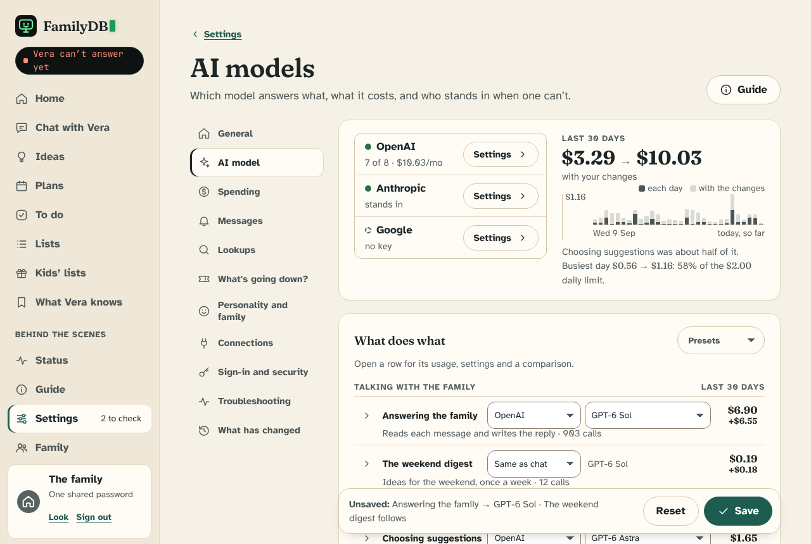
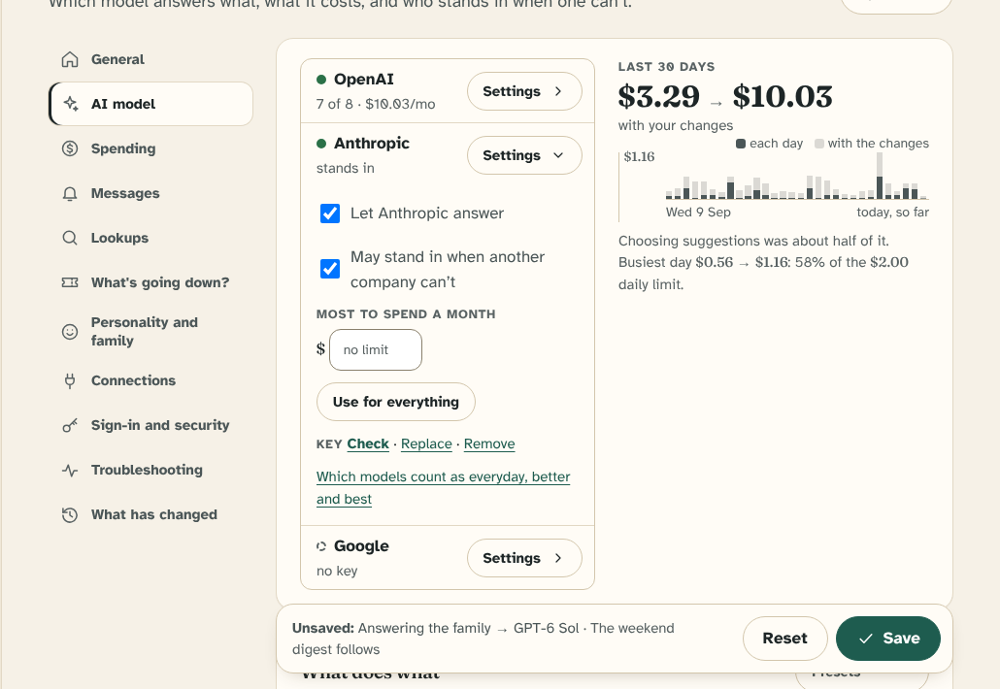
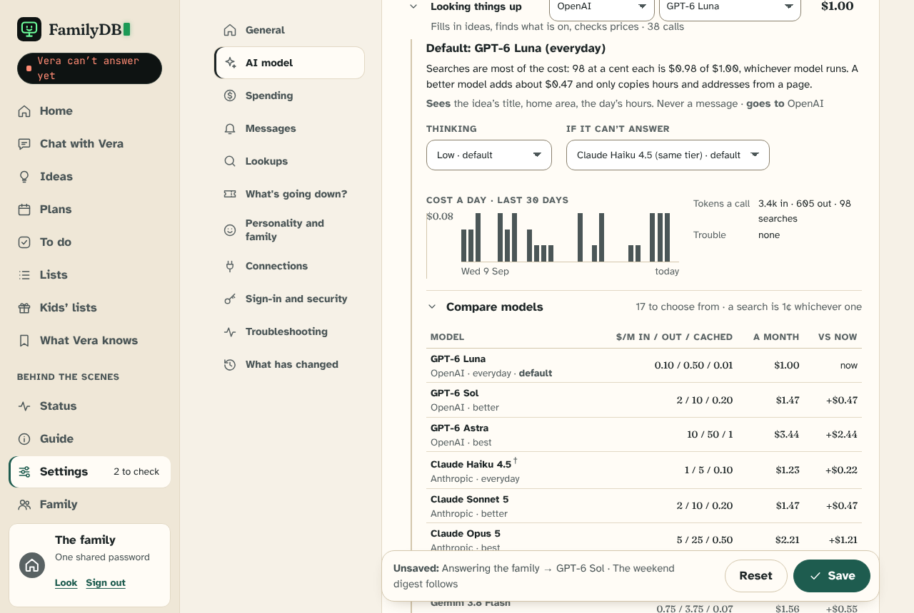

# The models page, redesigned

The settings page where an admin decides which model does what. **It is built** (`/settings/model`;
`web/models_page.py`, `web/templates/settings/model.html`, `static/models.css`, `static/models.js`,
`agent/uses.py`). It was designed as an interactive mockup (`docs/models-page/mockup.html`, three
screenshots beside it, a snapshot that is no longer kept in step) and put to the family, who chose it;
this document is why, what, which of the family's decisions it touched, and how it is built.
`docs/AI_CALLS.md` says how every model call is framed; this is about how an admin sees and steers them.

## Why

Today's page (`/settings/model`) is 5,160 pixels tall at a laptop's width and has 32 settings on ten
cards. It answers "which model does X?" in three steps, none of which says the answer:

1. **A company**: one global choice, plus a separate one for lookups.
2. **A strength**: `chat_level`, `digest_level` and `lookup_level` on the page, `judgement_level` and
   `choose_level` in other cards. A box reads "Default (everyday)" and nowhere says which model that is.
3. **A model for each company at each strength**: twelve boxes (six everyday, six better and best).

So eleven kinds of model call (`gateway.KINDS`) share five knobs. Things an admin plainly wants are
not expressible: a different company or model for one use (the digest, choosing suggestions, voice
notes), seeing what a change would cost, or choosing a company that has no key yet. The cost of each
use is on Status, a page away from the choice.

## The design

The page is organized around **what Vera does**, one row each, with the company and the model
chosen on the row, and everything else a click away.

| Part | What it is |
|---|---|
| **Header** | Three company cards (status, what each answers now and costs, a Settings control) beside the last 30 days' cost, as a daily chart. Pending changes show on the chart before they are saved. |
| **What does what** | Eight rows in five groups. Each: name, company dropdown, model dropdown, cost. A one-line description and the month's calls sit under the name. |
| **A row, opened** | The default and guidance, what it sees and which company gets it, thinking, stand-in and cap settings, a cost-a-day chart, a closed **Compare models** fold, and a closed fold of calls, notes and a command to measure it. |
| **A company, opened** | Let it answer; may stand in; most to spend a month; **Use for everything**; key check, replace, remove; a link to its everyday, better and best models. |
| **More settings** | The daily price check, the lineup of everyday, better and best models per company, and every key. |
| **Save bar** | Sticky: what is unsaved, **Reset** and **Save**, in view without scrolling. |

### The rows

| Row | Calls it covers (`gateway.KINDS`) | Default |
|---|---|---|
| Answering the family | `chat`, `retry` | everyday |
| The weekend digest | `digest` | same as chat |
| Choosing suggestions | `choose` | best, within its budget |
| Looking things up | `enrich`, `discover`, `places`, `price_check` | everyday |
| What's going down? | `scout`, `find_feeds` | same as looking things up |
| Voice notes | `transcribe` (OpenAI or Google only: Claude hears nothing) | OpenAI's cheapest |
| Photos | `look` | same as looking things up |
| Weighing changes | `judge` | off |

### Rules the page follows

- **One option per value.** Never "Yes (default), Yes, No". The default is marked on the value
  ("GPT-6 Luna · default") when it is not the one chosen, and a **Use default** link returns to it.
  "Same as chat" and "Off" are choices of the company dropdown, so the model list never repeats a model.
- **Every model is reachable.** The model list is everything with a price (17 today: five from OpenAI,
  eight from Anthropic, four from Google), cheapest first, plus **Other…** for any name, counted at
  `prices.UNLISTED` until the daily check knows it. Compare shows the nine lineup models, and the rest
  one click away. Changing company keeps the strength: Luna to Anthropic gives Haiku.
- **An unavailable company is greyed and still selectable** ("Google · no key", "OpenAI · off"). The
  row then says who answers instead, or that nothing can.
- **Each fact once.** What a use sees and where it goes, who stands in, its cap and its calls are each
  shown in one place. Costs are estimates re-priced from the last 30 days of `llm_calls` at each
  model's price (`prices.cost`), never a bill.
- **Closed by default.** On arrival the table is the page. Detail, comparison and company settings
  open in place.
- **Cost where the choice is.** A changed row shows its new month and the difference; the header shows
  the projected total; the chart shows the effect on each real day. Hovering or arrowing through a
  chart gives a day's calls, tokens and cost.
- **A pending change is neutral.** Amber is kept for a warning (an unavailable company), so the two
  are never confused.
- **Words.** "Company", "stand in" and the existing everyday, better and best. The page avoids "job",
  which already means a scheduled job in the guide and in `jobs/`.

## How it is built

### 1. Resolution (`agent/uses.py`)

- **One choice per row**, stored as `same:<row>`, `off` or `<company>:<model>`, replacing `chat_level`,
  `digest_level`, `lookup_level`, `judgement_level`, `choose_level` and the everyday boxes. Existing
  installs are read forward from their old settings, so nothing changes on upgrade. The everyday,
  better and best lineup stays, because stand-ins, presets and switching company use it.
- **`gateway.KINDS`** gains the row each kind belongs to; `gateway.answering` resolves through it.
- **Per-row thinking effort** (`Settings.use_effort`), laid over `effort` and `worker_effort`, which
  stay on Spending as what a row uses when it says nothing.
- **Companies come from the registry.** The cards, the company dropdowns and "Use for everything" list
  `companies.every(settings)` (`docs/COMPANIES.md`), so a company an admin has added is a card and an
  option like the three built in, greyed where it cannot do a row (an added company has no hosted
  search, so it is not offered for the lookup rows).
- **Per company** (`Settings.company_options`): allowed, may stand in, and a monthly limit, checked in
  `spending.admit(company=)` beside the existing budgets and counted from `llm_calls`. Stand-in goes
  to the first company, in the order a spare is looked for, that has a key, is allowed and may, and
  can do the use; where a company has not been told, `provider_fallback` still says for the three
  built in. A stand-in is per company, not per row: the mockup's per-row "If it cannot answer" box is
  a line saying who stands in.
- **An unavailable company can be chosen.** A call to one goes to the stand-in (`providers.Withheld`
  stands in the chosen company's place, so the loop's one-move-before-any-tool rule is unchanged), or
  waits for the retry job when none may.

### 2. The page (`web/models_page.py`)

Server-rendered rows and dropdowns; the cost series is local (`store/calls.py` `usage_rows`, the last
30 days by the family's day, then `prices.cost` at every candidate model). A use with no calls in the
window is priced at `TYPICAL_MONTH`, a family of four's, and says so. No page view calls a model.

- **Without scripts** every form still posts: each row is one dropdown of every model, grouped by
  company (the field a script fills from the company and model pair, so Save sends the same
  thing), and costs are the saved ones. The mockup's **Show cost** button was left out: costs show
  after Save. **Presets** and **Use for everything** only fill the form, so they are the script's.
- **The browser gets one JSON document** (`data-models`, a data attribute, not a script block, since
  the content policy and `tests/test_static.py` allow no inline script): every option's cost for each
  of the 30 days. `models.js` adds and subtracts, so the page and the daily limit never disagree.
- **A default is stored as nothing.** A choice equal to what the older settings say (`uses.default_choice`)
  is not stored, so the row keeps following whatever it follows; a default that follows another
  use's company (choosing suggestions follows chat's) is also sent as its value for each company, so
  the page can move it before anything is saved.
- **Settings the page replaced** (`fields.LEGACY`: `provider`, `worker_provider`, `provider_fallback`,
  the `*_level`s, the on-off toggles, the hearing models) are still read, are drawn nowhere, and
  `tests/test_settings_page.py` holds every other setting to exactly one page. A cap that is on another
  page's setting (`happening_budget`) is shown here with a link, not drawn twice.
- The sticky bar is the existing `.save-bar`; one form covers the rows, and a key is saved from its
  own fold, as before. **Check** on a company's card (`POST /settings/models/check/<slug>`) asks the
  company whether the saved key works and saves nothing.

### 3. Later, each on evidence

The model list from what each company's key may use (the daily check's `listed_models`); per-call
models inside a row; eval results beside a model (`python -m evals` exists, but covers only chat and
choosing today).

## Decisions it touched

`CLAUDE.md` says a family decision changes only by asking the family and saying what it costs or gains.
These were put to the family with the mockup and chosen; `docs/DESIGN.md` section 16 records them.

| Decision (`docs/DESIGN.md` §16) | Change | Cost or gain |
|---|---|---|
| Company chosen per surface (chat, lookup) | Chosen per use | Gain: one use can be moved alone, such as trying Claude for chat. Cost: more combinations to explain and test. |
| Choosing suggestions runs on the chat company | Its own company | Gain: a stronger model from another company. Cost: the family's words go there too. The page says so on the row, but the decision is theirs. |
| A company needs a key to be chosen | A company can be chosen without one | Gain: set up ahead, and keep a choice through a lapsed key. Cost: a use may be answered by a stand-in the admin did not look at; the row says who. |

## Alternatives considered

- **A list with a model picker open on every row** (the first mockup). Right units, but about 4,600
  pixels, and each fact appeared two or three times.
- **A goal-led page** ("What brings you here?", then a priced bill by job, written by a designer who
  had not seen the first). Strong on cost and on honest trade-offs, but too long, hid model names
  behind strengths for an admin who wants them, and showed test scores nobody can yet produce.
  Taken from it: the cost header and daily chart with a projected total, the "what this will not
  change" candor, who-sees-what on each row. Left out: the goal buttons, the invented scores, the
  7-day trial route, the strengths-only picker.

## Conventions this departs from

`docs/STYLE.md` is a record, not a fence, and these are chosen for the page. `STYLE.md` records
them under Settings.

- Controls in the table are about 40 pixels, not 44, because eight rows of two dropdowns need the
  density (WCAG 2.2's minimum target is 24).
- Disclosure arrows lead the row, rather than trail it, so every fold on the page agrees.
- The header leads with a figure and a sentence rather than only a sentence.
- Two things stay: the content policy and working without scripts, and the contrast tokens.

## The mockup

`docs/models-page/mockup.html` is one file with the app's own stylesheet and fonts inlined, drawn in
the app's real frame. Open it in a browser; it needs nothing else. It is a snapshot, so it will drift
from `static/style.css`, and the PR that builds the page replaces it.

- **Sample data.** A month for a family of four (903 chat calls, 38 lookups, 98 searches and so on),
  priced with `familydb.agent.providers.prices`. Calls per day, the status of each company (OpenAI and
  Anthropic have keys, Google does not) and the usage text are invented.
- **The script is the mockup's own.** It fills the dropdowns and works out costs so the page can be
  tried. In the app these come from the server.
- **What was checked, by script in Chromium:** every control responds; every model is reachable and no
  dropdown repeats a value; switching company keeps strength; an unavailable company can be chosen and
  says who answers; Use for everything fills the table and skips what a company cannot do; the save
  bar is in view at the top, middle and bottom; no closed dropdown cuts a word off; no dead link or
  empty fold; no sideways scrolling at 400 pixels.
- **Not checked:** a screen reader, touch hardware, other browsers.

## Settled while building it

- A per-company monthly limit is built (`CompanyOptions.monthly_limit`).
- **Use for everything** leaves rows that follow another following, and rows the company cannot do as
  they were; it says which.
- The lineup and the daily check live on this page, folded under **More settings**, with Status
  linking to them.

## Still open

- Should an unsaved row be marked beyond its difference, and how loudly?
- Are per-call models inside a row worth their cost in controls?
- Eval results beside a model, when `python -m evals` covers more than chat and choosing.

## Where it is written down

`src/familydb/wiki/controls/settings/ai-model.md`; `docs/AI_CALLS.md` ("Choosing models");
`docs/DESIGN.md` section 16; `docs/STYLE.md` (the conventions it departs from); `CLAUDE.md` (the
`agent/` and `web/` lines); `docs/COMPANIES.md`. Held by `tests/test_uses.py`,
`tests/test_company_options.py`, `tests/test_models_page.py` and the settings page tests.
